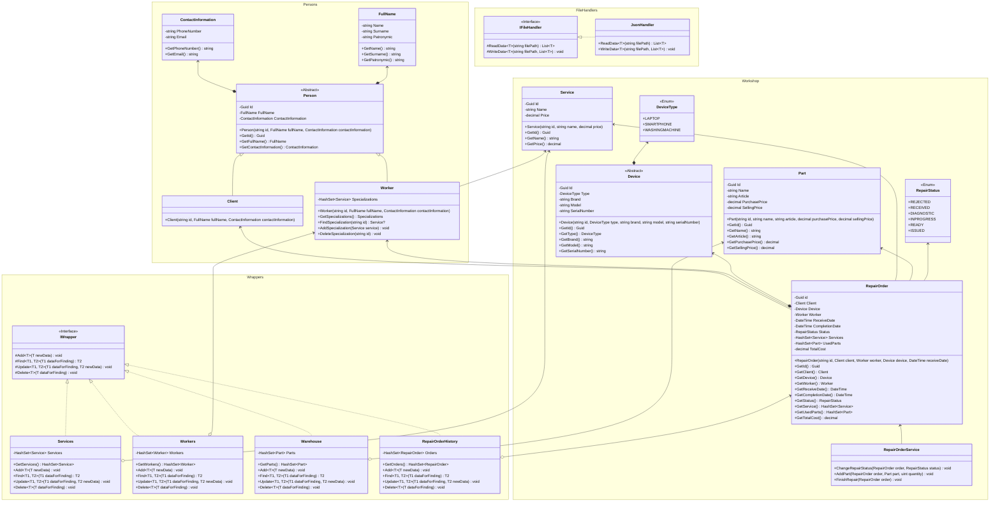

```mermaid
classDiagram
    namespace Persons {
        class Person {
            <<Abstract>>
            -Guid Id
            -FullName FullName
            -ContactInformation ContactInformation
            +Person(string id, FullName fullName, ContactInformation contactInformation)
            +GetId() Guid
            +GetFullName() FullName
            +GetContactInformation() ContactInformation
        }

        class ContactInformation {
            -string PhoneNumber
            -string Email
            +GetPhoneNumber() string
            +GetEmail() string
        }

        class FullName {
            -string Name
            -string Surname
            -string Patronymic
            +GetName() string
            +GetSurname() string
            +GetPatronymic() string
        }

        class Client {
            +Client(string id, FullName fullName, ContactInformation contactInformation)
        }

        class Worker {
            -HashSet~Service~ Specializations
            +Worker(string id, FullName fullName, ContactInformation contactInformation)
            +GetSpecializations() Specializations
            +FindSpecialization(string id) Service?
            +AddSpecialization(Service service) void
            +DeleteSpecialization(string id) void

        }
    }
    Person <|-- Client
    Person <|-- Worker
    ContactInformation <--* Person
    FullName <--* Person
    Client <-- RepairOrder
    Worker <-- RepairOrder

    namespace Workshop {
        class Device {
            <<Abstract>>
            -Guid Id
            -DeviceType Type
            -string Brand
            -string Model
            -string SerialNumber
            +Device(string id, DeviceType type, string brand, string model, string serialNumber)
            +GetId() Guid
            +GetType() DeviceType
            +GetBrand() string
            +GetModel() string
            +GetSerialNumber() string
        }

        class Service {
            -Guid Id
            -string Name
            -decimal Price
            +Service(string id, string name, decimal price)
            +GetId() Guid
            +GetName() string
            +GetPrice() decimal
        }


        class Part {
            -Guid Id
            -string Name
            -string Article
            -decimal PurchasePrice
            -decimal SellingPrice
            +Part(string id, string name, string article, decimal purchasePrice, decimal sellingPrice)
            +GetId() Guid
            +GetName() string
            +GetArticle() string
            +GetPurchasePrice() decimal
            +GetSellingPrice() decimal
        }

        class DeviceType {
            <<Enum>>
            +LAPTOP
            +SMARTPHONE
            +WASHINGMACHINE
        }

        class RepairStatus {
            <<Enum>>
            +REJECTED
            +RECEIVED
            +DIAGNOSTIC
            +INPROGRESS
            +READY
            +ISSUED
        }

        class RepairOrder {
            -Guid id
            -Client Client
            -Device Device
            -Worker Worker
            -DateTime ReceiveDate
            -DateTime CompletionDate
            -RepairStatus Status
            -HashSet~Service~ Services
            -HashSet~Part~ UsedParts
            -decimal TotalCost
            +RepairOrder(string id, Client client, Worker worker, Device device, DateTime receiveDate)
            +GetId() Guid
            +GetClient() Client
            +GetDevice() Device
            +GetWorker() Worker
            +GetReceiveDate() DateTime
            +GetCompletionDate() DateTime
            +GetStatus() RepairStatus
            +GetService() HashSet~Service~
            +GetUsedParts() HashSet~Part~
            +GetTotalCost() decimal

        }
        

        class RepairOrderService {
            +ChangeRepairStatus(RepairOrder order, RepairStatus status) void
            +AddPart(RepairOrder order, Part part, uint quantity) void
            +FinishRepair(RepairOrder order) void
        }
    }
    Device <--* RepairOrder
    Service <-- Worker
    Service <-- RepairOrder
    Part <-- RepairOrder
    DeviceType <--* Device
    RepairStatus <-- RepairOrder
    RepairOrder <-- RepairOrderService

    namespace Wrappers {
        class IWrapper {
            <<Interface>>
            #Add~T~(T newData) void
            #Find~T1, T2~(T1 dataForFinding) T2
            #Update~T1, T2~(T1 dataForFinding, T2 newData) void
            #Delete~T~(T dataForFinding) void
        }

        class Services {
            -HashSet~Service~ Services
            +GetServices() HashSet~Service~
            +Add~T~(T newData) void
            +Find~T1, T2~(T1 dataForFinding) T2
            +Update~T1, T2~(T1 dataForFinding, T2 newData) void
            +Delete~T~(T dataForFinding) void
        }

        class Workers {
            -HashSet~Worker~ Workers
            +GetWorkers() HashSet~Worker~
            +Add~T~(T newData) void
            +Find~T1, T2~(T1 dataForFinding) T2
            +Update~T1, T2~(T1 dataForFinding, T2 newData) void
            +Delete~T~(T dataForFinding) void
        }

        class Warehouse {
            -HashSet~Part~ Parts
            +GetParts() HashSet~Part~
            +Add~T~(T newData) void
            +Find~T1, T2~(T1 dataForFinding) T2
            +Update~T1, T2~(T1 dataForFinding, T2 newData) void
            +Delete~T~(T dataForFinding) void
        }

        class RepairOrderHistory {
            -HashSet~RepairOrder~ Orders
            +GetOrders() HashSet~RepairOrder~
            +Add~T~(T newData) void
            +Find~T1, T2~(T1 dataForFinding) T2
            +Update~T1, T2~(T1 dataForFinding, T2 newData) void
            +Delete~T~(T dataForFinding) void
        }
    }
    IWrapper <|.. Services
    IWrapper <|.. Workers
    IWrapper <|.. Warehouse
    IWrapper <|.. RepairOrderHistory
    Service <--o Services
    Worker <--o Workers
    Part <--o Warehouse
    RepairOrder <--o RepairOrderHistory

    namespace FileHandlers {
        class IFileHandler {
            <<Interface>>
            #ReadData~T~(string filePath) List~T~
            #WriteData~T~(string filePath, List~T~) void
        }

        class JsonHandler {
            +ReadData~T~(string filePath) List~T~
            +WriteData~T~(string filePath, List~T~) void
        }
    }
    IFileHandler <|.. JsonHandler
```